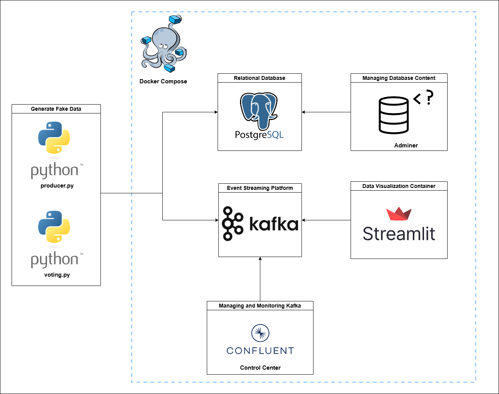

# Painel de Eleições em Tempo Real com Kafka e Streamlit


Este projeto é uma simulação de um sistema de votação em tempo real, utilizando Kafka, PostgreSQL e Streamlit. Ele demonstra como integrar diferentes tecnologias para processar e visualizar dados em tempo real.

## Sumário

- [Visão Geral](#visão-geral)
- [Arquitetura](#arquitetura)
- [Tecnologias Utilizadas](#tecnologias-utilizadas)
- [Pré-requisitos](#pré-requisitos)
- [Instalação](#instalação)
- [Execução](#execução)
- [Funcionalidades](#funcionalidades)
- [Como Funciona](#como-funciona)
- [Licença](#licença)

## Visão Geral

O projeto simula uma eleição onde:

- **Produtores** geram dados de votantes e os enviam para um tópico Kafka.
- **Consumidores** processam esses votantes, simulam votos e enviam os resultados para outro tópico Kafka.
- **Banco de Dados** armazena os dados dos votantes, candidatos e votos.
- **Painel em Streamlit** exibe em tempo real os resultados da eleição, podendo consumir dados diretamente do banco de dados ou do Kafka.

## Arquitetura



1. **Producer (`producer.py`):**
   - Gera dados de votantes usando a API `randomuser.me`.
   - Envia os dados para o tópico Kafka `voters_topic`.
   - Insere os votantes no banco de dados PostgreSQL.

2. **Consumer (`voting.py`):**
   - Consome os votantes do tópico `voters_topic`.
   - Simula votos para os candidatos.
   - Envia os votos para o tópico `votes_topic`.
   - Insere os votos no banco de dados PostgreSQL.

3. **Painel Streamlit (`streamlit-app.py`):**
   - Exibe os resultados em tempo real.
   - Pode consumir dados diretamente do banco de dados ou do Kafka.
   - Oferece três telas:
     - Painel de Eleições (consumindo do banco de dados).
     - Monitoramento de Votantes.
     - Painel via Kafka (consumindo diretamente do Kafka).

---

## Tecnologias Utilizadas

-  **Python 3.8+**
-  **Apache Kafka**
-  **PostgreSQL**
-  **Streamlit**
- **Confluent Kafka Python Client**
-  **Docker e Docker Compose**

---


## Pré-requisitos

- **Docker** e **Docker Compose** instalados.
- **Python 3.8+** instalado.
- Conexão à internet para baixar imagens Docker e dependências.

## Instalação

1. **Clone o repositório:**
```bash
   git clone https://github.com/bixtecnologia/kafka-tutorial.git
   cd kafka-tutorial
```

2. **Crie um ambiente virtual e ative-o:**
```bash
    python -m venv venv
    source venv/bin/activate  # No Windows: venv\Scripts\activate
```

3. **Instale as dependências Python:**
```bash
    pip install -r requirements.txt
```

4. **Instale as dependências Python:**
```bash
    docker-compose up -d
```
Isso iniciará os contêineres do Kafka, Zookeeper, PostgreSQL e outros serviços necessários.

## Execução

1. **Execute o produtor:**

Em um terminal separado:
```bash
    python producer.py
```
- Este script gerará votantes e os enviará para o Kafka e o banco de dados.

2. **Execute o consumidor de votos:**

Em outro terminal:
```bash
    python voting.py
```
- Este script consumirá votantes do Kafka, simulará votos e enviará os resultados para o Kafka e o banco de dados.

3. **Execute o aplicativo Streamlit:**

Em outro terminal:
```bash
    streamlit run streamlit-app.py
```
- Abra o navegador em http://localhost:8501 para visualizar o painel.

## Funcionalidades
- **Painel de Eleições:**
    - Exibe em tempo real o total de votos, o candidato líder e estatísticas detalhadas.
    - Consome dados do banco de dados.

- **Monitoramento de Votantes:**
    - Mostra um gráfico em tempo real do número de votantes sendo inseridos no banco de dados.

- **Painel via Kafka:**
    - Exibe os resultados da eleição consumindo dados diretamente do Kafka para atualizações instantâneas.

## Como Funciona
**Produtor (```producer.py```):**
- Utiliza a API randomuser.me para gerar dados fictícios de votantes.
- Envia esses dados para o tópico ```voters_topic``` no Kafka.
- Insere os votantes no banco de dados PostgreSQL.

**Consumidor (```voting.py```):**
- Consome os dados do tópico ```voters_topic```.
- Simula votos aleatórios para os candidatos.
- Envia os votos para o tópico ```votes_topic```.
- Insere os votos no banco de dados PostgreSQL.


- **Aplicativo Streamlit:**
    - **Painel de Eleições:**
        - Conecta-se ao banco de dados e consulta os votos.
        - Atualiza em intervalos regulares.

    - **Painel via Kafka:**
        - Implementa um consumidor Kafka para receber votos em tempo real.
        - Atualiza a interface instantaneamente à medida que novos votos chegam.

## Autor
| Desenvolvedor      | LinkedIn                                   | Email                        |
|--------------------|--------------------------------------------|------------------------------|
| Alvaro Justus    | [LinkedIn](https://www.linkedin.com/in/alvaro-justus-5b6141b7/) | alvaro.justus@bix-tech.com        |